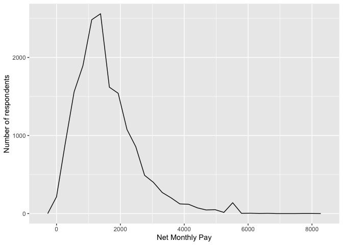
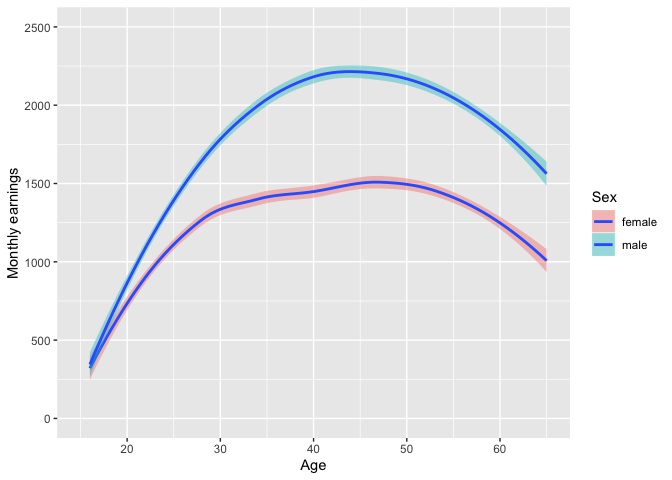
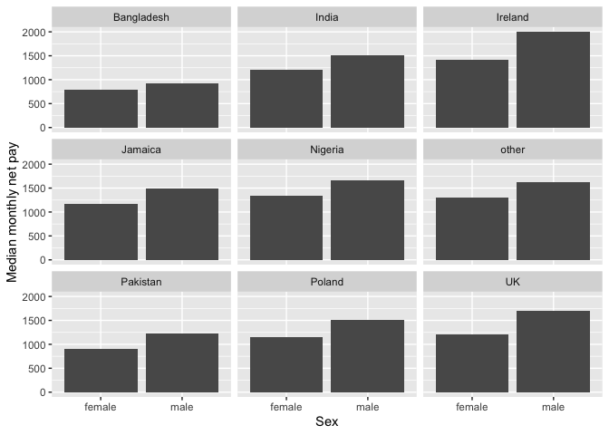
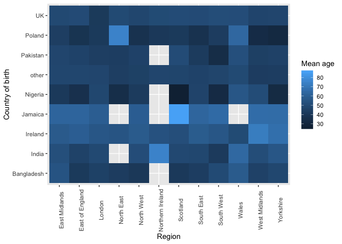
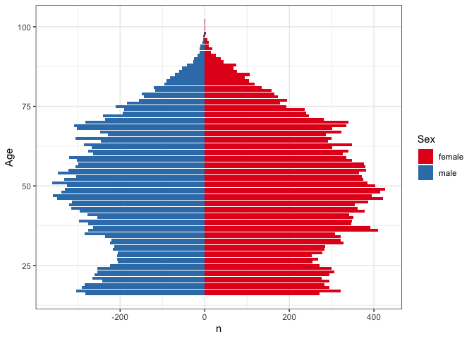

Statistical assignment 4
================
Benjamin Machon 680011539
02/03/2020

In this assignment you will need to reproduce 5 ggplot graphs. I supply
graphs as images; you need to write the ggplot2 code to reproduce them
and knit and submit a Markdown document with the reproduced graphs (as
well as your .Rmd file).

First we will need to open and recode the data. I supply the code for
this; you only need to change the file paths.

    ```r
    library(tidyverse)
    Data8 <- read_tsv("/Users/benmachon/Downloads/UKDA-6614-tab/tab/ukhls_w8/h_indresp.tab")
    Data8 <- Data8 %>%
        select(pidp, h_age_dv, h_payn_dv, h_gor_dv)
    Stable <- read_tsv("/Users/benmachon/Downloads/UKDA-6614-tab/tab/ukhls_wx/xwavedat.tab")
    Stable <- Stable %>%
        select(pidp, sex_dv, ukborn, plbornc)
    Data <- Data8 %>% left_join(Stable, "pidp")
    rm(Data8, Stable)
    Data <- Data %>%
        mutate(sex_dv = ifelse(sex_dv == 1, "male",
                           ifelse(sex_dv == 2, "female", NA))) %>%
        mutate(h_payn_dv = ifelse(h_payn_dv < 0, NA, h_payn_dv)) %>%
        mutate(h_gor_dv = recode(h_gor_dv,
                         `-9` = NA_character_,
                         `1` = "North East",
                         `2` = "North West",
                         `3` = "Yorkshire",
                         `4` = "East Midlands",
                         `5` = "West Midlands",
                         `6` = "East of England",
                         `7` = "London",
                         `8` = "South East",
                         `9` = "South West",
                         `10` = "Wales",
                         `11` = "Scotland",
                         `12` = "Northern Ireland")) %>%
        mutate(placeBorn = case_when(
                ukborn  == -9 ~ NA_character_,
                ukborn < 5 ~ "UK",
                plbornc == 5 ~ "Ireland",
                plbornc == 18 ~ "India",
                plbornc == 19 ~ "Pakistan",
                plbornc == 20 ~ "Bangladesh",
                plbornc == 10 ~ "Poland",
                plbornc == 27 ~ "Jamaica",
                plbornc == 24 ~ "Nigeria",
                TRUE ~ "other")
        )
    ```

Reproduce the following graphs as close as you can. For each graph,
write two sentences (not more\!) describing its main message.

1.  Univariate distribution (20 points).
    
    ``` r
    ggplot(data = Data, aes(x = h_payn_dv)) +
        geom_freqpoly() + 
        labs(y = "Number of respondents", x = "Net Monthly Pay")
    ```
    
    <!-- --> This
    plot shows that just over £1000 is the most common monthly pay for
    the respondents in the survey. After a small spike at around 5,500
    the number of respondents remains at 0.

2.  Line chart (20 points). The lines show the non-parametric
    association between age and monthly earnings for men and women.
    
    ``` r
    # Age for both sexes
    byAge <- Data %>%
      group_by(h_age_dv) %>%
      summarise(
    monthly = mean(h_payn_dv, na.rm = TRUE)
      )
    
    
    # splitting up sex
    
    byAgeSex <- Data %>%
      filter(!is.na(sex_dv)) %>%
      group_by(h_age_dv, sex_dv) %>%
      summarise(
    monthly = mean(h_payn_dv, na.rm = TRUE)
      ) %>%
    ggplot(aes(x = h_age_dv, y = monthly, fill = sex_dv)) +
    geom_smooth() +
    xlim(15,65) +
    ylim(0,2500) +
    labs(x = "Age", y = "Monthly earnings", fill = "Sex")
    
    byAgeSex
    ```
    
    <!-- -->
    
    ``` r
    # I struggled to change the colour and pattern of the lines.
    ```
    
    This line graph shows us the relationship between the age of a
    person and their monthly earnings. Both me and women’s average
    monthly wages increase until the age of 45 before they plateau and
    decrease slightly. However, it remains noticeable that a man’s
    average monthly earnings remain significantly higher than that of a
    woman throughout their lifetime

3.  Faceted bar chart (20 points).
    
    ``` r
    byNat <- Data %>%
      group_by(placeBorn, sex_dv) %>%
      summarise(
    monthly = median(h_payn_dv, na.rm = TRUE)
      ) %>%
        filter(!is.na(sex_dv)) %>%
    filter(!is.na(placeBorn)) %>%
    
      ggplot(aes(x = sex_dv, y = monthly)) +
      geom_bar(stat = "identity") +
        labs(x = "Sex", y = "Median monthly net pay") +
    facet_wrap(~ placeBorn)
    
    byNat
    ```
    
    <!-- --> This
    graph helps to show the distribution of pay between men and women,
    grouped by the country in which they were born. In every case, men
    earn more than women on (median) average per month

4.  Heat map (20 points).
    
    ``` r
       HeatRegion <- Data %>%
        group_by(h_gor_dv, placeBorn) %>%
        summarise(meanage = mean(h_age_dv, na.rm = TRUE)) %>%
        filter(!is.na(h_gor_dv)) %>%
        filter(!is.na(placeBorn)) %>%
    
    
    ggplot(aes(x = h_gor_dv, y = placeBorn, fill = meanage)) +
    geom_tile() +
        labs(x = "Region", y = "Country of birth", fill = "Mean age") +
        theme(axis.text.x = element_text(angle = 90)) 
    
    HeatRegion
    ```
    
    <!-- --> This
    graph show the average age of respondents according to where they
    were born and where they now reside within the UK. Therefore we can
    visualise more particular findings, such as

5.  Population pyramid (20 points).
    
    ``` r
    PP <- Data %>%
        group_by(h_age_dv, sex_dv) %>%
        count(h_age_dv) %>%
        filter(!is.na(sex_dv)) %>% 
        filter(!is.na(h_age_dv)) %>%
        mutate(n = ifelse(sex_dv == "male", -n, n))%>%
        rename(sex = sex_dv) 
    
    PP %>%
        ggplot(aes(x = h_age_dv, y = n, fill = sex)) +
        geom_bar(data = subset(PP, sex = "Female"), stat = "identity") +
        geom_bar(data = subset(PP, sex = "Male"), stat = "identity") +
        coord_flip() +
        labs(x = "Age", y = "n", fill = "Sex") +
        scale_fill_brewer(palette = "Set1") +
    theme_bw()
    ```
    
    <!-- --> This
    graph shows the age distribution of respondents according to sex.
    There is a spike around 40 - 50 years of age showing that it is one
    of the most common age range in the survey. Up until 50, the
    respondents shows a steasding increase as the age increases. After
    50 the number of respondents begins to decrease rather sharply.
